## 👋 Introduction: Why Hardware Matters to Software

If you write Python, Javascript, or Go, it is really easy to ignore hardware. Your language has a Garbage Collector. It manages memory for you. You declare an array, push a million items into it, and it just magically scales. So why should a software engineer care about the physical CPU or RAM? 🤔

Because high-level languages abstract away the hardware, but **they do not erase the laws of physics.**

When your production server suddenly throttles, when your backend consumes 10x more memory than it should, or when your database queries take seconds instead of milliseconds—that is not just a "code" issue. That is your software violently hitting a physical, mechanical constraint of the machine.

Software abstractions lie to us. They make us think memory is an infinite void and CPUs are magic math boxes. But under the hood, your beautiful, clean code is being translated into physical electrical signals moving across literal copper wires.

If we want to stop being "read-only" developers and actually engineer scalable systems, we need to understand the brutal reality of the hardware our code runs on.

Let's strip away the software abstractions and look at the metal.

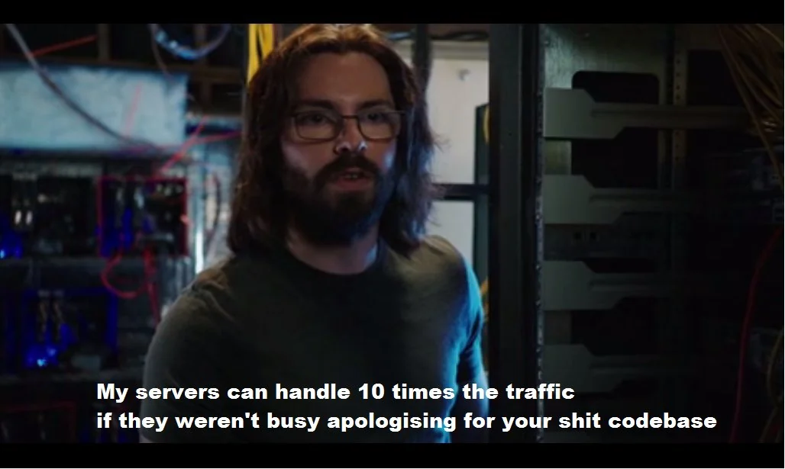

---

## 🏗️ The Von Neumann Architecture.
Before we talk about the code, we need to look at the blueprint of the machine running it. In 1945, John von Neumann described a hardware architecture that almost every modern computer—from your Apple Watch to a massive AWS EC2 server-still uses today.

The core, revolutionary idea of this architecture is simple: **Programs and data share the same memory space.** Your compiled application code and the user data it is currently processing sit physically next to each other in the exact same RAM.

Here is what that machine looks like.
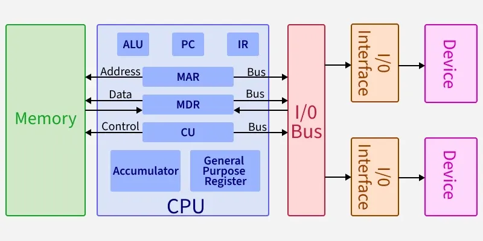

To understand how our software executes, we need to break this architecture down into its three main physical components, and more importantly, how they connect.

### The CPU (The Executor)
The Central Processing Unit is the brain, but realistically, it is just an incredibly fast, obedient calculator. It holds almost no data itself; its only job is to execute instructions. It is divided into two main sub-units: 

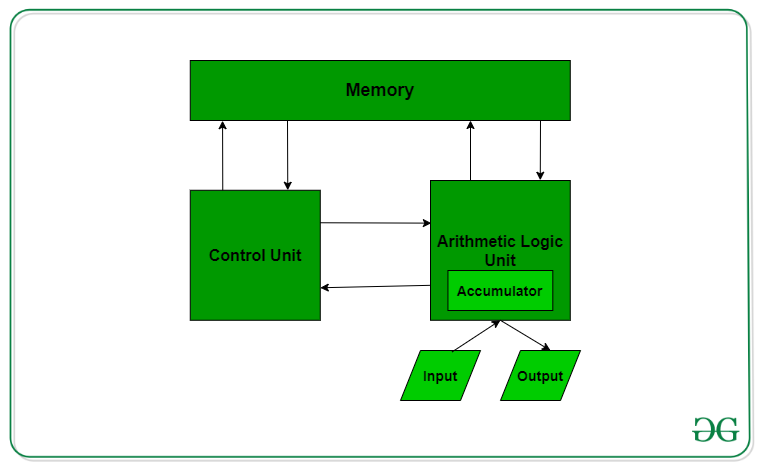

* **ALU (Arithmetic Logic Unit):** This is the actual calculator. It performs mathematical operations (addition, subtraction) and logical operations (`AND`, `OR`, `NOT`). When your code evaluates an `if` statement, the ALU is doing the physical comparison.
* **CU (Control Unit):** The traffic manager. It fetches the next instruction from memory, decodes it to figure out what needs to happen, and signals the ALU, memory, or I/O devices to take action.   

### The Memory Hierarchy (RAM & Storage)

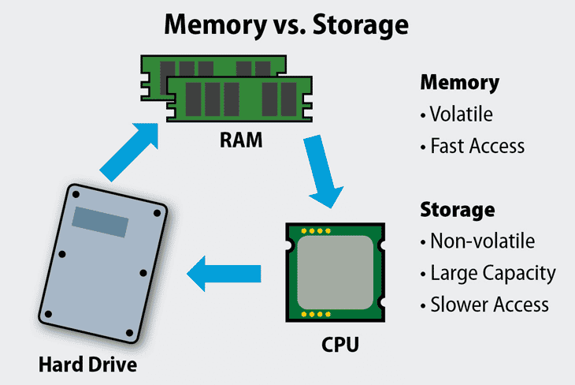

Because the CPU cannot store a whole program, it relies on external memory
* **Main Memory (RAM):** This is volatile, working memory. When you execute a program, the OS loads it from disk into RAM. If the server loses power, RAM is wiped instantly. It is fast, but as we will see, it is often not fast enough.
* **Storage (Disk/SSD):** This is non-volatile, permanent storage. Where your database files and OS live. Disk is incredibly slow. In high-performance backend systems, if your application has to read from disk to serve a real-time user request, your performance is already severely degraded.

### The System Bus (The Physical Bottleneck)
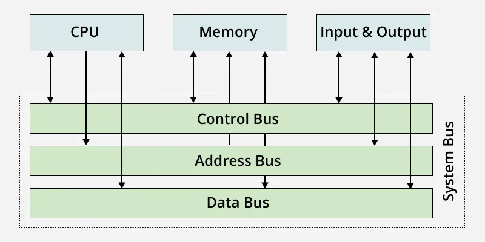
This is the piece most software engnineers completely ignore, but it dictates all of our performance limits. 

The CPU and RAM are physically separate chips mounted on the motherboard. To communicate, electrical signals must travel across microscopic copper wires called the System Bus. The bus is divided into three channels:
1.  **Address Bus:** The CPU sends the exact physical memory address it wants to interact with (e.g., "Memory location `0x7FFF`").
2.  **Control Bus:** The CPU sends the command signal (e.g., `READ` or `WRITE`).
3.  **Data Bus:** The actual binary data travels back and forth across these wires (e.g., the integer `42`).

### 🛑 The Von Neumann Bottleneck (Why this matters to you)
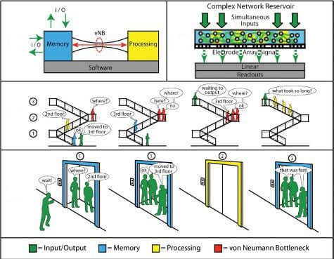

Here is the under-the-hood reality: modern CPUs are insanely fast. They can execute billions of operations per second. But the System Bus is physical copper, and RAM is relatively slow.

Because the CPU is forced to fetch every single instruction and every single piece of data across this bus, **the CPU spends most of its life literally doing nothing, just waiting for electrical signals to arrive from RAM.** This physical limitation is called the *Von Neumann Bottleneck*. This single hardware constraint is the exact reason why caching exists, why memory-safe languages have performance overhead, and why choosing the right data structure can make your code run 100x faster.

To understand how to beat this bottleneck, we need to look at the exact language the hardware speaks: the Instruction Set Architecture.

---

## ⚙️ Instruction Set Architecture (ISA).
If the CPU is just a calculator made of copper and silicon, how does it actually know what your software wants it to do?

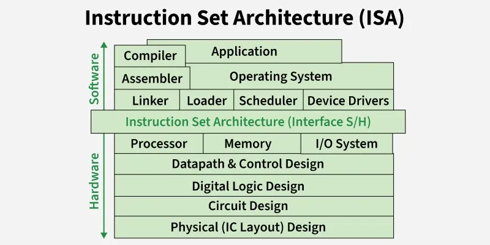

This is where the **Instruction Set Architecture (ISA)** comes in. The ISA is the exact boundary where software turns into hardware. You can think of it as the API for the CPU. It defines the strict, unchangeable "vocabulary" of machine code instructions that the physical chip is hardwired to understand.

When you compile a Go binary or run a Docker container, your code is translated into this specific vocabulary. And right now, the tech industry is split between two entirely different vocabularies.

### CISC vs. RISC (x86 vs. ARM)
There are two primary design philosophies for how a CPU should read instructions:

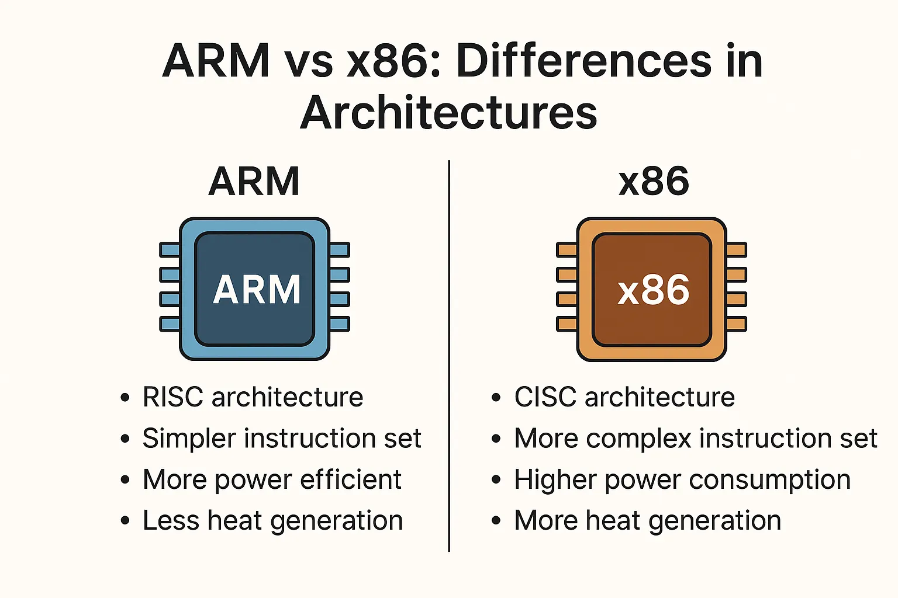

**1. CISC (Complex Instruction Set Computer) - x86 Architecture**
* **Examples:** Intel and AMD processors. This is the traditional powerhouse of cloud servers and gaming PCs.
* **How it works:** CISC relies on *complex* instructions. A single line of machine code might tell the CPU to fetch data from RAM, perform multiplication, and write it back to RAM all at once. 
* **The Trade-off:** Because the instructions do so much heavy lifting, the compiler generates fewer lines of machine code. However, the physical CPU requires complex hardware to decode these multi-step instructions, which draws massive amounts of power and generates a lot of heat.

**2. RISC (Reduced Instruction Set Computer) - ARM Architecture**
* **Examples:** Apple Silicon (M1/M2/M3 chips) and AWS Graviton servers.
* **How it works:** RISC relies on *simple, single-cycle* instructions. A RISC processor cannot read from memory and do math in the same step. It requires one instruction to load data, a second to multiply, and a third to store it. 
* **The Trade-off:** The compiler has to generate far more lines of machine code. But because each instruction is incredibly simple, the physical CPU can execute them insanely fast, using significantly less electricity and generating barely any heat.

### 🛑 Why Software Engineers Must Care
If you have ever built a Docker image on your new Macbook (which uses an ARM chip) and tried to deploy it to a standard AWS EC2 instance (which uses an x86 chip), you know exactly what happens: **The container violently crashes on startup.**

It crashes because the EC2 CPU physically cannot understand the ARM machine code vocabulary your Macbook compiled.

Furthermore, understanding the ISA is why the entire cloud industry is shifting. AWS pushes companies to migrate to Graviton (ARM) instances because RISC architecture uses less electricity. When you operate at the scale of a data center, less power equals lower cooling costs, which translates to cheaper cloud bills for your backend infrastructure.

--- 

## 💡 The Instruction Cycle & The Memory Hierarchy.
Now that we know the CPU has a specific vocabulary (ISA) and has to pull data across physical wires (System Bus), we need to look at how it actually executes your code. 

The CPU is driven by a physical clock. When you buy a "3.2 Ghz" processor, that means its internal clock ticks 3.2 billions times per second. With every tick, the CPU runs through a continous loop called the **Instruction Cycle**: 

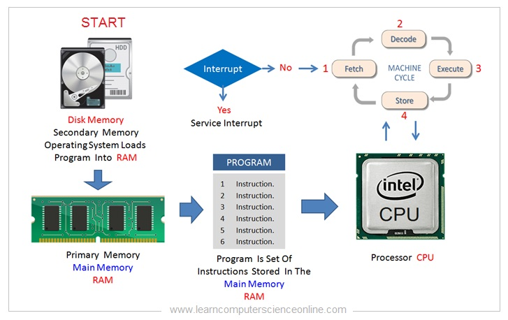

1.  **Fetch:** The Control Unit requests the next instruction/data from memory.
2.  **Decode:** The CPU translates the instruction based on its ISA.
3.  **Execute:** The ALU performs the math or logic operation.
4.  **Store:** The result is written back to memory.

Here is the brutal truth about this cycle: Steps 2, 3, and 4 are blindingly fast. But **Step 1 (Fetch) is the bottleneck**. If the CPU has to wait for data to travel all the way from RAM across the System Bus, the entire cycle halts.

To prevent the CPU from wasting billions of cycles just sitting idle, hardware engineers created a caching system.

### The Memory Hierarchy

Because fast memory is expensive and physically large, computers use a tiered system. As you move further away from the CPU, memory gets larger, cheaper, but painfully slow.

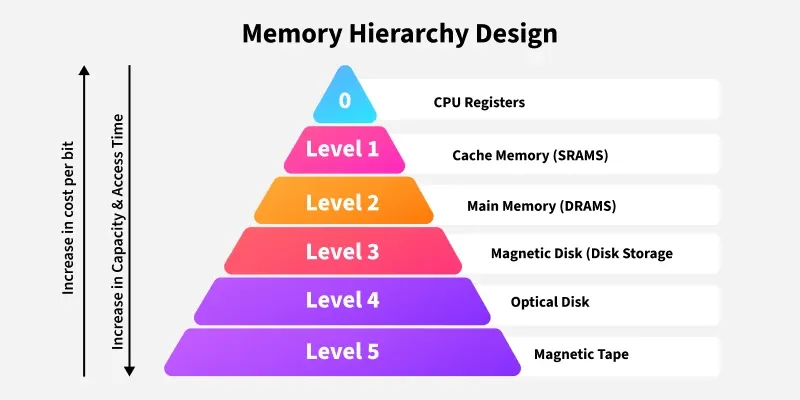

* **Registers:** Located directly inside the CPU core. Zero latency. This is what the CPU is actively computing *right now*.
* **L1 / L2 / L3 Cache:** Small memory chips physically glued to the CPU die. 
    * *L1 Cache* is tiny (usually 64KB) but takes ~1 nanosecond to read.
    * *L3 Cache* is larger (e.g., 32MB) and is shared across CPU cores. Takes ~10 nanoseconds.
* **Main Memory (RAM):** Located off-chip. Holds gigabytes of data. Takes ~100 nanoseconds to read.
* **Disk (SSD/HDD):** Located far away. Takes milliseconds (millions of nanoseconds). To a CPU, reading from disk is an eternity.

### 🛑 The Cache Miss (The Silent Performance Killer)
When your code asks for a variable, the CPU first checks the ultra-fast L1 cache. If it is there, great! That is a **Cache Hit** 🤩.

But what if it isn't? That is a **Cache Miss**. The CPU now has to check L2, then L3. If it is still not there, the CPU must halt execution, send a request across the System Bus to RAM, and wait. A single cache miss to RAM can cost the CPU hundreds of wasted clock cycles.

If your backend code is constantly causing cache misses, it doesn't matter if your algorithm is mathematically efficient. Your hardware is choking.

### 📊 Hardware vs. Data Structures: Array vs. Linked List
Let's tie this directly to a classic interview question: *"Why is iterating through an Array faster than a Linked List, even though both are O(N) time complexity?"*

To understand the answer, you have to know how the CPU fetches data. The CPU does not pull single bytes from RAM. To be efficient, it pulls chunks of contiguous memory called **Cache Lines** (usually 64 bytes at a time). This is based on the principle of **Spatial Locality**: if your code needs one piece of data, it will probably need the data right next to it very soon.

* **Arrays:** In an array, elements are stored in physically contiguous memory blocks. When you access `array[0]`, the CPU suffers one cache miss to pull it from RAM. But because it pulls a 64-byte chunk, `array[1]`, `array[2]`, and `array[3]` are automatically pulled into the ultra-fast L1 cache at the same time. The next few loops are instant cache hits.
* **Linked Lists:** Every node in a linked list is allocated randomly on the heap. They are scattered everywhere. When you access `node1`, you get a cache miss. The CPU pulls the 64-byte chunk, but `node2` isn't in it. It's at some random address. So when you move to `node2`, you get another cache miss. And another. And another.

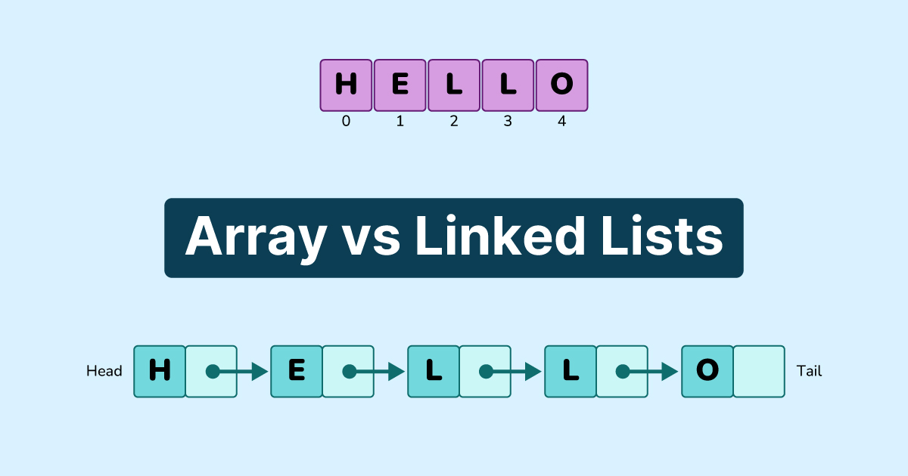

Mathematically, both are O(N). But mechanically, the Linked List forces the CPU to constantly halt and fetch from RAM, while the Array feeds the Instruction Cycle perfectly.

---
## 🚀 Summary & What's Next
Software engineering is, at its core, the art of managing physical hardware constraints.

In this chapter, we stripped away the magic of high-level languages. You now know that:
* **CPU spikes** happen when your instructions force the ALU to work overtime.
* **OOM (Out of Memory) crashes** happen when you exhaust the physical RAM limits of the Von Neumann architecture.
* **High latency** often isn't a network issue—it is a hardware issue caused by Cache Misses and the physical bottleneck of the System Bus.

Now that we understand the physical constraints of the machine, we need to know how to write software that actually respects them.

In **Chapter 2**, we are going to dive into **Algorithms and Data Structures**. We will look at Big O Notation, Arrays, Linked Lists, and Queues—not as abstract math concepts to memorize, but as physical memory layouts that either perfectly feed the CPU or completely starve it.

Thanks for reading this far, and I'll see you in the next chapter! 🤗

