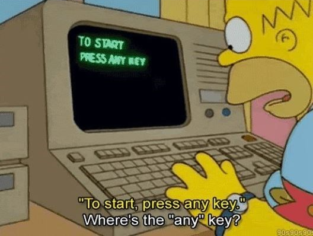

## 👋 1. Introduction 

Tbh, for the longest time, my learning routine looked exactly like this: read a ton of tech blogs, binge-watch system design videos, nod along to architectures... and absolutely never touch my keyboard to write a single line of code. 

I was basically a read-only developer. I honestly thought my brain was a highly available database of tech knowledge, ready to pass any interview. 

But the reality? I only knew the happy path. I didn't actually know what happens under the hood. When an interviewer asks a follow-up or a problem-solving question to evaluate my critical thinking, I get totally stuck and barely know how to answer, ending up just talking in circles :v. I couldn't tell you the real-world trade-offs, how to debug an OOM (Out of Memory) crash, or why a missing WAL destroys your data. All I had was raw, surface-level theory and some pretty boxes and arrows in my head.

Arggg, it hurts to say it out loud! But I realized I need to change my mindset immediately. If I want this knowledge to actually belong to me, I have to stop being a spectator. No more just reading about other people's systems—I have to start implementing the code myself to see exactly how they break.

## 🛠️ 2. The Philosophy

So, what's the plan? We are going to build simplified, raw versions of these systems from scratch. 

Why? Because you don't truly respect a Mutex lock until you've watched two threads casually corrupt your data at the exact same time. You don't understand why Eviction Policies matter until your toy cache eats **100%** of your RAM and your OS forcefully kills the process.

You only understand the value of an abstraction after you’ve felt the pain of living without it. By running into the exact same brick walls that the original creators hit, the theory finally clicks into place.

## 🗺️ 3. The Roadmap 

In this series, we are going to open up the black boxes of system design. Here is what we are going to build:

* 💡 **Build your own Cache:** We'll start with an in-memory Key-Value store. Sounds easy until we have to implement a Time-To-Live (TTL) sweeper and figure out LRU (Least Recently Used) eviction without tanking performance.
* 💡 **Build your own Message Queue:** A simple Pub/Sub broker. We will see firsthand why Acknowledgements (ACKs) and retries are mandatory when a consumer mysteriously dies halfway through processing a message.
* 💡 **Build your own Database:** Moving from RAM to disk. We will intentionally crash our program mid-write to see data corruption in action—and then fix it by implementing our own Write-Ahead Log (WAL).

Time to switch from a read-only node to a primary write node. Let's get our hands dirty.

## 🚀 4. What's Next? 

Alright, enough talking. The whole point of this post is to stop reading and start coding, so I'll keep this short.

In the next post, we are going to dive straight into **Chapter 1: Building an in-memory Cache**. We'll start with a basic hash map, slap on a TTL sweeper, and watch things spectacularly break when concurrency hits.

If you've ever been asked "how does Redis work?" in an interview and just panicked and said "uh, it stores data in RAM," this next post is exactly for you.

Have a nice day, and let's go write some bugs! 🪲