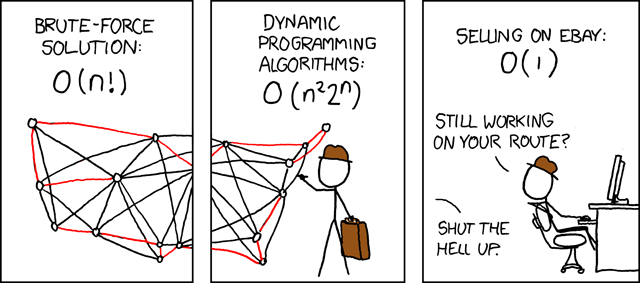
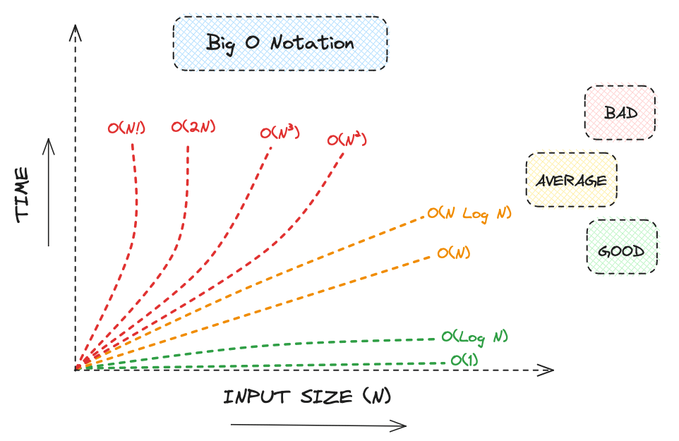
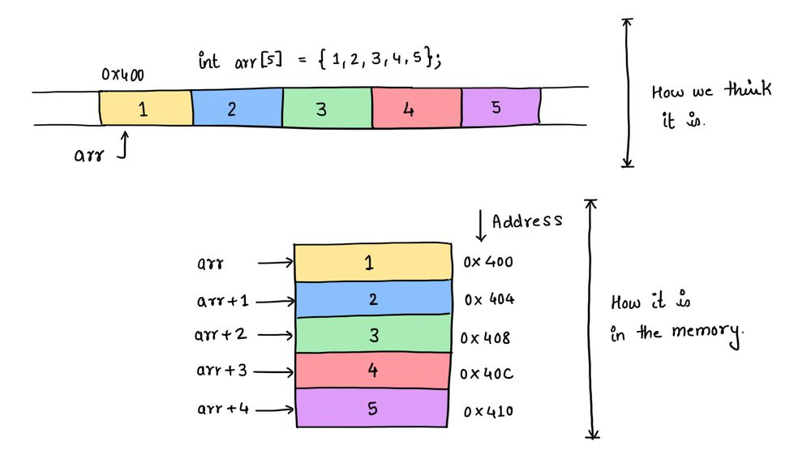
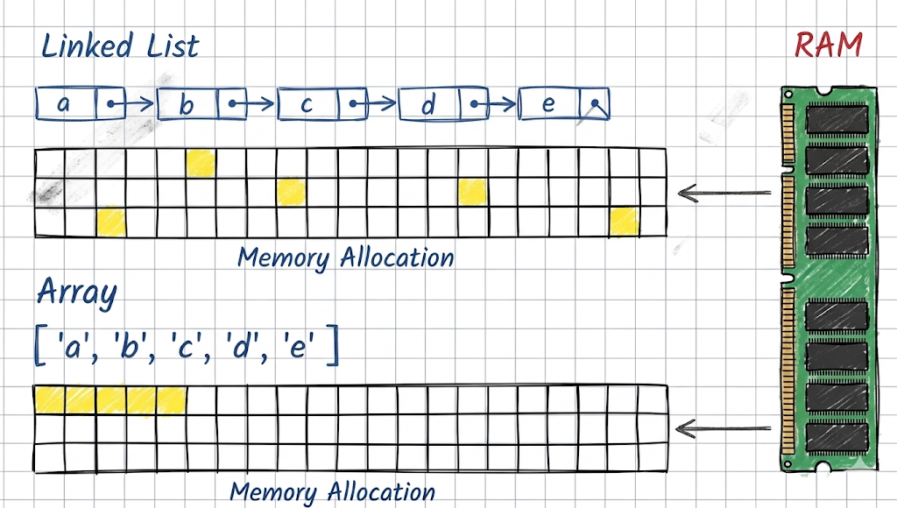
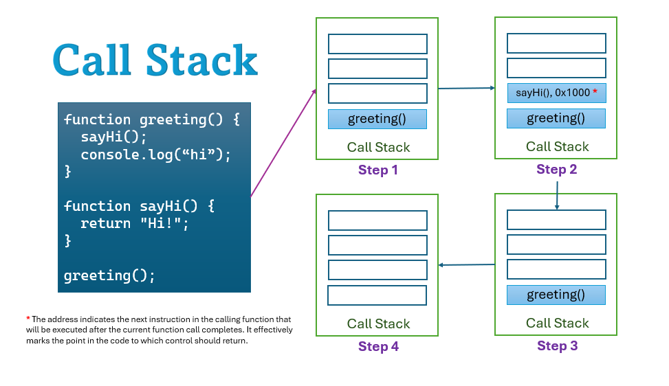
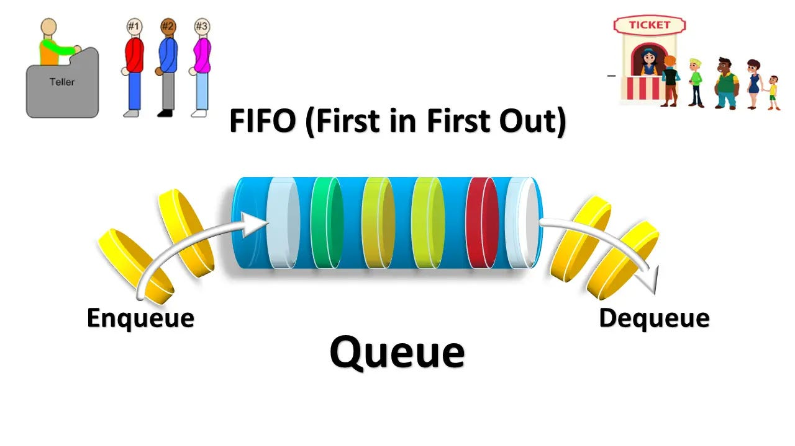

## 🎯 Introduction: Math vs. The Machine

Ciao! If you have ever prepared for a technical interview, you have probably grinded LeetCode. And if you have grinded LeetCode, you were likely taught that Data Structures are purely abstract mathematical concepts.

We are told to memorize Big O Notation like it is an absolute law of nature. We learn that inserting a new item into a Linked List is $O(1)$ (constant time), but inserting into an Array is $O(N)$ (linear time). Based on pure math, the Linked List sounds vastly superior, right 🤨? 

But here is the reality check: **abstract math does not execute on your server.** Electrical signals do.

In the previous post, we uncovered the brutal reality of the Von Neumann bottleneck. We saw that the CPU does not care about your elegant mathematical proofs; it only cares about pulling physical Cache Lines across a copper System Bus. When we look at code through the lens of hardware, the "rules" of Big O Notation can actually lie to you.

In this chapter, we are going to strip away the academic theory. We will look at Big O Notation and Linear Data Structures (Arrays, Linked Lists, Stacks, Queues) for exactly what they are: **different ways to physically arrange bytes in RAM to optimize for read speed, write speed, or memory usage.** Let's bridge the gap between LeetCode math and actual production hardware.

---

## ⏱️ Big O Notation: Scaling on Hardware

Let's strip away the university definitions. When you are building a backend system, Big O Notation is not just an academic grading scale. It is a framework to answer one very specific, terrifying question: 

> *If my database grows from 1,000 rows to 1,000,000 rows, will my CPU melt down, or will my server run out of RAM?*

Big O measures the **rate of growth**. It tells us how the hardware requirements of our algorithm scale as the input data ($N$) gets larger. We measure this in two dimensions:

1.  **Time Complexity (CPU Limits):** This does not measure literal seconds. It measures **CPU Instruction Cycles**. As data grows, how many extra *Fetch-Decode-Execute* loops does the CPU have to run?
2.  **Space Complexity (RAM Limits):** As data grows, how many extra physical bytes of memory do we have to allocate on the heap?

In the real world of building standard backend features, you only need to deeply care about these three core complexities right now:

### O(1) - Constant Time 
The CPU does the exact same amount of work regardless of the data size. Whether your array has 10 items or 10 billion items, the hardware executes the exact same number of instruction cycles.
* *Example:* Accessing `userArray[5]`. The CPU calculates the physical memory address using simple math and fetches it instantly.

### O(N) - Linear Time
The CPU workload scales 1:1 with the data size. If your data increases by 10x, the CPU must execute 10x more instruction cycles. This is acceptable for small datasets but becomes a bottleneck at scale.
* *Example:* Iterating through a list of users to find a specific email because you forgot to add a database index. If you have a million users, the CPU might have to do a million fetches.

### O(N^2) - Quadratic Time 
The workload scales exponentially. If your data increases by 10x, the CPU workload increases by **100x**. If you deploy an $O(N^2)$ algorithm to production, it will inevitably cause a CPU spike and throttle your system as soon as traffic hits.
* *Example:* A nested `for` loop. Comparing every single item in a list against every other item in that same list.

Big O gives us the mathematical theory of scaling. Now, let's look at how this theory collides with physical hardware when we actually store data in RAM.

---

## 📦 Memory Layouts: Arrays vs. Linked Lists

This is the core of how software interacts with hardware. When you need to store sequential data, there are two fundamental ways to arrange those bytes in physical RAM.

### The Array (Contiguous Memory)
* **How it looks in RAM:** An array allocates a single, unbroken block of physical memory. If you store 10 integers, they sit directly next to each other on the hardware.
* **Read Access ($O(1)$):** To read `array[5]`, the CPU takes the starting memory address and simply adds the offset. It jumps directly to that exact byte. Furthermore, because the memory is contiguous, fetching index `0` automatically pulls the adjacent indices into the ultra-fast L1 Cache (Spatial Locality). The CPU executes this perfectly.
* **Insertions & Deletions ($O(N)$):** If you want to insert a new item at index `0`, you must physically shift every subsequent item in the block one space to the right in RAM. If the array reaches its capacity, the CPU must allocate a brand new, larger block of memory and copy every single item over.

### The Linked List (Scattered Memory & Pointers)
* **How it looks in RAM:** A linked list does not need a single contiguous block. Every item (node) is allocated randomly on the heap wherever space is available. Each node stores the data *and* a pointer (the exact physical memory address) to the next node.
* **Insertions & Deletions ($O(1)$):** To insert a node in the middle, you do not shift any memory. You simply update the pointer of the previous node to point to the new node's address. 
* **Read Access ($O(N)$):** You cannot mathematically calculate the address of node 5. You must start at node 1, read its pointer, jump across RAM to node 2, read its pointer, and so on. Because the nodes are scattered physically, the CPU cannot utilize the L1 Cache. Every jump is a **Cache Miss**, forcing the CPU to halt and fetch from RAM.

### The Verdict: Hardware Over Math
According to pure Big O theory, Linked Lists seem better for dynamic data because insertions are $O(1)$, while Array insertions are $O(N)$. 

However, in modern software engineering, we almost exclusively use dynamic arrays (like `slices` in Go, `Vectors` in C++, or `ArrayList` in Java). The physical speed of the CPU L1 Cache is so fast that shifting contiguous memory is often mechanically faster than chasing scattered pointers across RAM and triggering constant cache misses.

---

## 🧱 Stacks & Queues: Logical Restrictions

If Arrays and Linked Lists dictate how data is physically laid out in RAM, Stacks and Queues are simply rulesets applied on top of them.

They are not new memory layouts. Under the hood, a Stack is usually just an Array, and a Queue is usually a Linked List (or a circular Array). We use them because intentionally restricting how we interact with data prevents bugs and enforces a specific system flow.

### The Stack (LIFO: Last In, First Out)
* **The Rule:** You can only interact with the "top" of the stack. You `push` data onto the top, and you `pop` data off the top. Both operations are $O(1)$ because you never have to shift underlying memory.
* **Under the Hood:** Usually implemented as an Array.
* **Production Use Case: The Call Stack.** When you write backend code, the CPU uses a physical Stack to track function calls. If `functionA` calls `functionB`, the CPU pushes `functionA`'s local variables onto the stack, pauses it, and pushes `functionB` on top. When `functionB` finishes, it is popped off, and the CPU perfectly resumes `functionA`.

### The Queue (FIFO: First In, First Out)
* **The Rule:** Data enters at the "back" (`enqueue`) and leaves from the "front" (`dequeue`). It functions exactly like a line at a coffee shop. Both operations are $O(1)$. 
* **Under the Hood:** Usually implemented as a Linked List. If you used a standard Array, removing the first item (`dequeue`) would force the CPU to shift every other item in RAM to the left, turning an $O(1)$ operation into an $O(N)$ bottleneck. 
* **Production Use Case: Message Brokers.** Queues are the backbone of modern system architecture. If 10,000 users hit your API at the exact same millisecond, writing all 10,000 directly to your database will spike the CPU and crash the system. Instead, you `enqueue` those requests into a Queue (like RabbitMQ or Kafka). Background workers then `dequeue` and process them sequentially at a safe speed.

By applying a simple FIFO rule to memory, you protect your entire backend infrastructure from collapsing under sudden traffic spikes.

---

## 🚀 Summary & What's Next

Every cache, database, and message broker on earth is physically built on top of Arrays and Linked Lists. They are the fundamental ways we allocate physical memory. Stacks and Queues are simply strict rules applied to those memory blocks to keep our systems predictable and prevent crashes under heavy load.

But linear data structures have a fatal hardware and mathematical flaw: **Searching them is slow.**

If you need to find a specific user ID in an Array or Linked List containing 1 billion records, the CPU has to scan them one by one. This is an $O(N)$ operation. In production, executing an $O(N)$ database query against a billion rows will completely lock up your CPU and take down your service.

So, how do databases search billions of rows in milliseconds? They stop organizing data in a straight line. 

In the next chapter, we are going to break the linear constraint. We will explore non-linear memory layouts—**Trees and Graphs**—and see exactly how database indexes use B-Trees to crush that $O(N)$ bottleneck down to $O(\log N)$, making massive-scale data retrieval physically possible.

Thanks for reading, and see you in the next chapter 🥰!

