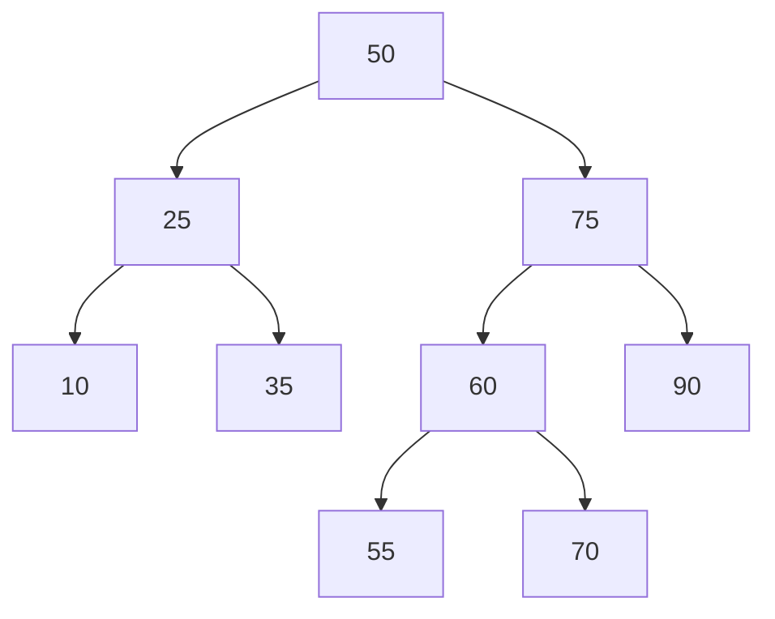

## 🎯 Introduction: The 1-Billion Row Problem

Welcome back! In the previous posts, we established that Arrays and Linked Lists are the foundational ways to allocate physical memory. They dictate how bytes are packed into RAM and how the CPU's L1 cache fetches that data. 

But linear data structures have a fatal mechanical flaw: **searching them scales linearly.**

Suppose you have an array containing 1,000,000,000 user records. You receive an API request to retrieve the data for `user_id = 999,999,999`. Because an array is just a straight line of contiguous memory, a basic linear search forces the CPU to start at index `0` and evaluate every single record sequentially. 

In term of Big O Notation, this is an $O(N)$ operation. In terms of physical hardware, this means the CPU must execute nearly 1 billion *Fetch-Decode-Execute* cycles just to find a single user. If you production database operated this way, a concurrent traffic spike of just 50 users executing read queries would immediately peg your CPU at 100% utilization, exhaust your system resources, and take down the entire server 🤯.

To build backend systems that scale to massive datasets, we cannot store and search data in a straight line. We must introduce hierarchy and relationships to completely bypass the $O(N)$ hardware bottleneck. 

In this post, we are abandoning linear memory layouts and examining **Non-Linear Data Structures**. We will look at exactly how Trees enable relational databases to search billions of row in milliseconds, and how Graphs map complex relationships in network routing and recommendation engines.

---

## 🌳 Trees: The Engine of Database Indexes

To bypass the $O(N)$ bottleneck, we must organize data so that the CPU can skip over vast chunks of memory it doesn't need to read. We achieve this using a Tree.

### The Binary Search Tree (BST)

At its core, a Tree is just a collection of Nodes (similar to a Linked List) connected by pointers. But instead of pointing to one "next" node, a Binary Tree node points to *two* child nodes: a Left child and a Right child.

To make this searchable, we enforce a strict mathamatical rule to create a **Binary Search Tree (BST)**:

1. Every value in the Left subtree must be **smaller** than the parent node.
2. Every value in the Right subtree must be **larger** than the parent node.

### The Math: Crushing O(N) into O(log N)
This simple rule fundamentally changes how the CPU operates.

If we execute a query for `user_id = 70` in the tree above:
1. The CPU starts at the root (`50`). `70` is larger, so it branches Right.
2. At `75`, `70` is smaller, so it branches Left.
3. At `60`, `70` is larger, so it branches Right. 
4. It finds `70`.

By branching Right at the root, the CPU physically ignored the entire left side of the tree. Every single time the CPU makes a decision, it eliminates **half** of the remaining dataset.

This scale logarithmically: $O(\log{N})$.

If you have 1 billion records, a linear array requires up to 1,000,000,000 instruction cycles. With a perfectly balanced BST, $\log_{2}(1,000,000,000) \approx 30$. The CPU finds the exact record in exactly **30 steps**. You just mathematically optimized a database query from seconds down to nanoseconds. 

### 🛑 The Production Reality: B-Trees
According to university textbooks, the BST is the ultimate search structure. But in a production database like PostgreSQL or MySQL, pure Binary Search Trees are almost never used for database indexing. Instead, relational databases use **B-Trees** (Balanced Trees).

Why 🤔? Because of the physical hardware limits we discussed in the Chapter 1.

A pure BST holds exactly one value per node. Because nodes are allocated dynamically on the heap, traversing a BST requires the CPU to constantly chase pointers across scattered physical memory addresses, triggering Cache Misses. Furthermore, databases store persistent data on disk (SSDs), not just RAM. If your tree has 1 billion records, a BST will be 30 levels deep. Navigating to the bottom requires 30 separate Disk I/O reads, which is mechanically slow.

A **B-Tree** solves this hardware constraint by making the tree "short and fat".

Instead of one value per node, a B-Tree node holds an array of multiple values (e.g., hundreds of keys) inside a single contiguous block. Database engineers intentionally size these nodes to perfectly match a standard physical **Disk Page** (usually 4KB or 8KB) or a CPU Cache Line. 

When the CPU fetches a B-Tree node, it pulls an entire 8KB chunk of keys into memory in a single Disk I/O operation. It instantly scans that array leveraging the L1 Cache, figures out the exact child pointer it needs, and jumps down. A B-Tree can store billions of records while only being 3 or 4 levels deep, meaning finding any record requires a maximum of 3 or 4 physical disk reads.

This is the perfect example of bridging software abstraction and hardware reality: mathematically, $O(\log{N})$ is fast, but mechanically, aligning your data structures with physical Disk Pages is what actually makes the database scale under heavy load.

---

## 🕸️ Graphs: Modeling the Real World
Trees are highly optimized for hierarchical data, but the real world is messy. Data does not always flow strictly top-down from a single root node. 

What happens when you need to store data where everything can be connected to everything else 🧐? You cannot use a Tree to map a physical road network, and you cannot use it to map Facebook friendships. For unstructured, interconnected data, we use a **Graph**.

At a hardware level, a Graph is just a collection of nodes scattered in memory, joined together by pointers. In graph terminology: 
* **Vertices (Nodes):** The actual data entities (e.g., a User, a City, a Microservice).
* **Edges:** The physical pointers connecting the vertices.
    * *Undirected Edges:* Two-way connections. (e.g., Facebook friends).
    * *Directed Edges:* One-way connections. (e.g., Twitter followers. Just because you follow an account does not mean it points back to you).
    * *Weighted Edges:* Connections that carry a cost. (e.g., The travel time between two cities on a map).

### Production Use Cases
Graphs are the underlying architecture for the most complex systems in software engineering:
* **Recommendation Engines:** When Amazon says "Customers who bought this also bought...", they are executing queries across a massive user-product graph.
* **Network Routing:** The internet itself is a graph. When you send an HTTP request, TCP/IP routers use graph algorithms (*Dijkstra*) to calculate the fastest path across global data centers.
* **Microservice Architecture:** Modern cloud infrastructures use graphs to map dependencies. If `Service A` goes down, the orchestrator uses a graph to determine exactly which downstream services will fail.

### Graph Traversals: BFS vs. DFS
How does a CPU actually search a massive graph without getting stuck in an infinite loop? It relies on the linear data structures we built in the previous post: **Stacks and Queues**.

There are two primary ways to search a graph.

#### Breadth-First Search (BFS)
BFS explores the graph layer by layer, like a ripple spreading outward in a pond. It checks all immediate neighbors before moving deeper.
* **Under the hood:** BFS is physically driven by a **Queue (FIFO)**. When the CPU visits a node, it pushes all of that node's neighbors to the back of the queue. It then processes the queue from the front. This guarantees that closer nodes are processed first.
* **Production Application:** **Shortest Path**. If you want to find the fastest driving route on Google Maps, or the fewest network hops between two servers, you use BFS.

#### Depth-First Search (DFS)
DFS aggressively plunges down a single path as far as possible. If it hits a dead end, it backtracks to the last intersection and tries the next path. 

* **Under the Hood:** DFS is physically driven by a **Stack (LIFO)**. (Usually the CPU's own Call Stack via recursion). When the CPU visits a node, it pushes it onto the stack and immediately dives into its first neighbor.
* **Production Application:** **Cycle Detection**. If `Microservice A` calls `Service B`, which calls `Service C`, and someone accidentally makes `Service C` call `Service A`, you have created an infinite loop that will crash your entire cluster. Dependency managers and compilers use DFS to map the graph and detect these fatal circular dependencies before deployment.

### How do you solve a maze?
Depth-first search is a common way that many people naturally approach solving problems like mazes. First, we select a path in the maze (for the sake of the example, let's choose a path according to some rule we lay out ahead of time) and we follow it until we hit a dead end or reach the finishing point of the maze. If a given path doesn’t work, we backtrack and take an alternative path from a past junction, and try that path. Below is an animation of a DFS approach to solving this maze.

--- 

## 🧠 Advanced Problem Solving: The Space-Time Trade-off
Traversing massive trees and graphs introduces a new physical constraint. In complex networks, there are often multiple paths to the same node.

Imagine using DFS to calculate the fastest route through a city grid. The CPU might calculate the path from `Intersection A` to `Intersection B`, backtrack, take a different route, and accidentally end up at `Intersection B` again. If the algorithm is naive, the CPU will re-calculate the exact same path from `B` to the destination all over again.

Mathematically, recalculating overlapping subproblems causes your time complexity to explode from linear time $O(N)$ to exponential time $O(2^N)$. Mechanically, an $O(2^N)$ algorithm will completely lock up a standard server CPU even if the dataset only has 50 items.

To solve this, we rely on the fundamental rule of system optimization: **The Space-Time Trade-off.**

If you lack CPU power (Time), you must spend physical RAM (Space) to compensate. We do this using a technique called **Memoization** (the foundation of Dynamic Programming).

### Caching Graph Traversal
Instead of blindly burning CPU cycles re-calculating nodes, we introduce the data structure: Hash Map.

* When the CPU calculates the path for `Intersection B` for the first time, it stores the final result in the Hash Map. This consumes a few bytes of physical RAM.
* When the CPU inevitably reaches `Intersection B` from a different path, it checks the Hash Map first.
* It finds the answer instantly ($O(1)$) and immediately returns, skipping thousands of wasted instruction cycles.

By spending a small amount of RAM to cache intermediate states, we physically optimize exponential algorithms back down to linear time. In backend engineering, almost every performance bottleneck can be solved by deciding whether it is cheaper to burn CPU cycles or allocate RAM.

---
## 🚀 Summary & What's Next
We have officially broken the $O(N)$ linear constraint.

You now understand the complete memory layout stack:
* **Arrays and Linked Lists** are the foundational blocks. They dictate how bytes are packed into RAM and how the CPU cache physically fetches data.
* **Trees (B-Trees)** organize those blocks hierarchically, allowing databases to discard millions of records instantly and execute $O(\log N)$ searches.
* **Graphs** abandon strict hierarchy entirely, using pointers to map complex, many-to-many relationships for network routing and recommendation engines.

We have learned how data sits in physical hardware. But a massive question remains.

When we create an Array, who actually finds the empty contiguous bytes in RAM? When we launch a goroutine to run a BFS graph traversal, who tells the physical CPU core to execute it 🤔?

Your application code does not have the authority to talk directly to the hardware. It must ask for permission from the ultimate system manager.

In the next chapter, we are going to dive into the **Operating Systems**. We will strip away the OS abstractions and look at how it manages physical memory, the brutal difference between a Process and a Thread, and how the OS scheduler juggles 10,000 concurrent network requests on an 8-core machine.

Thanks for reading, and see you then 😸!

