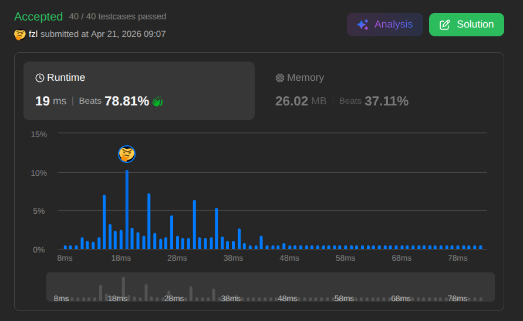

## 🎯 1. Problem Breakdown

[Gas Station - LeetCode](https://leetcode.com/problems/gas-station/)

You are given a circular route with $N$ gas stations. You have a car with an infinite gas tank. You are provided two integer arrays of length $N$:
* `gas[i]`: The amount of gas physically available at station $i$.
* `cost[i]`: The amount of gas required to drive from station $i$ to the next station $(i + 1) \% N$.

**The Objective:** Find the exact starting station index that allows you to travel the complete circuit exactly once. If no such index exists, return `-1`. 

**The Constraint:** Your gas tank cannot drop below `0` at any point during transit. If the `cost` to reach the next station exceeds your current tank volume plus the `gas` at your current station, the transit fails.

---

## 📐 2. The Greedy Approach

### The Naive O(N^2) Bottleneck
The most direct way to solve this is brute-force simulation. You iterate through every station `i` and run a nested loop to simulate driving the entire circle. If the tank drops below zero, the inner loop breaks, and you move to the next starting station `i + 1`.

The problem states that the number of stations $N$ can be up to $10^5$. An $O(N^2)$ algorithm requires up to $10^{10}$ operations in the worst-case scenario. Because a standard CPU executes roughly $10^8$ operations per second, this nested loop will result in a **Time Limit Exceeded (TLE)** error. We must optimize to $O(N)$ using a single pass.

### The Two Greedy Rules
To achieve an $O(N)$ solution, we eliminate redundant computations by relying on two logical rules:

**Rule 1: The Global Check**
If the total sum of `gas` across all stations is strictly less than the total sum of `cost`, it is physically impossible to complete the loop. You will always run out of gas, regardless of where you start. Return `-1`. 

*Corollary:* If `sum(gas) >= sum(cost)`, it is guaranteed that at least one valid starting station exists.

**Rule 2: The Failure Window**
Suppose you start at station `A` and successfully travel through several intermediate stations, but your tank drops below `0` when attempting to travel from station `B` to `B+1`. 

You cannot reach `B+1` from `A`. More importantly, **you cannot reach `B+1` from any station between `A` and `B`.** *Proof:* When you traveled from `A` to an intermediate station, you arrived there with a gas tank $\ge 0$. If you instead start fresh at that intermediate station, your tank starts at exactly `0`. Having less gas than the previous attempt guarantees you will still fail at `B`.

*Optimization:* Because every station between `A` and `B` is mathematically guaranteed to fail, do not test them. Skip the entire failure window and set your next potential starting station directly to `B+1`.

---

## ⚙️ 3. The Algorithm Execution (Single Pass)

Based on the greedy rules established, the algorithm executes in a clean, single-pass structure:

1.  **Rule 1 (Global Check):** Before entering any loops, calculate the total sums of both arrays. If `sum(gas)` is strictly less than `sum(cost)`, return `-1` immediately.
2.  **State Variables:** Initialize a `start` pointer at index `0` to track the assumed starting station, and an `accum` variable to track the current gas volume in the tank.
3.  **Rule 2 (Local Check):** Iterate through the arrays. At each step `i`, update the `accum` tank by adding the net gas of the current station (`gas[i] - cost[i]`).
4.  **The Reset:** If `accum` drops below zero, the current `start` station and all intermediate stations up to `i` are mathematically invalid. Reset `accum` to `0` and set the new `start` pointer to the next station `i + 1`.
5.  **Return:** Because the global check initially guaranteed that a valid solution exists, the `start` pointer remaining at the end of the loop is definitively the correct answer.

---

## 💻 4. Code Implementation

Here is the Python implementation mapping directly to the execution logic:

```python
class Solution:
    def canCompleteCircuit(self, gas: List[int], cost: List[int]) -> int:
        # Rule 1: The Global Check
        if sum(gas) < sum(cost):
            return -1
        
        start, accum, n = 0, 0, len(gas)
        
        # Rule 2: The Failure Window
        for i in range(n): 
            accum += gas[i] - cost[i]
            
            # Tank dropped below zero. Skip the entire failure window.
            if accum < 0: 
                start = i + 1
                accum = 0
                
        return start
```

---

## 📊 5. Complexity Analysis
- **Time Complexity:** $O(N)$. The native Python sum() functions iterate through the arrays once. The for loop iterates through the arrays exactly one time. $2N$ operations mathematically simplifies down to $O(N)$ linear time.
- **Space Complexity:** $O(1)$. We only allocate memory for three primitive integer variables (start, accum, n). The memory footprint remains strictly constant regardless of the size of the input arrays. No auxiliary data structures are used.

