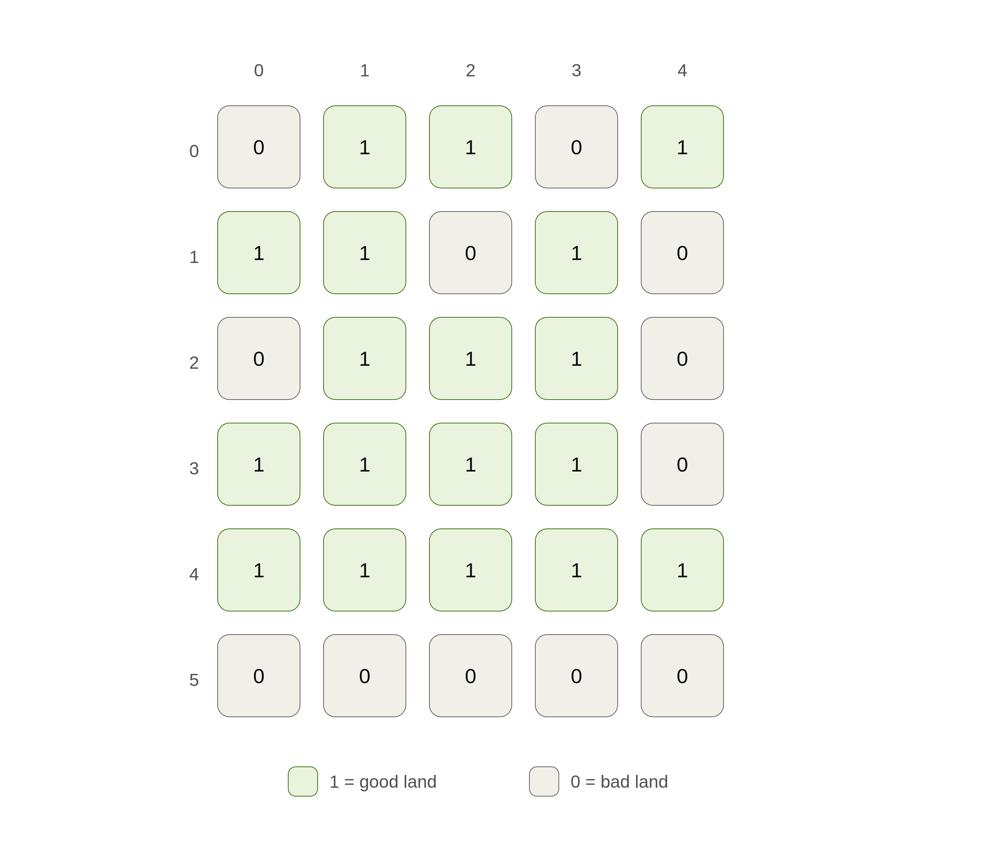
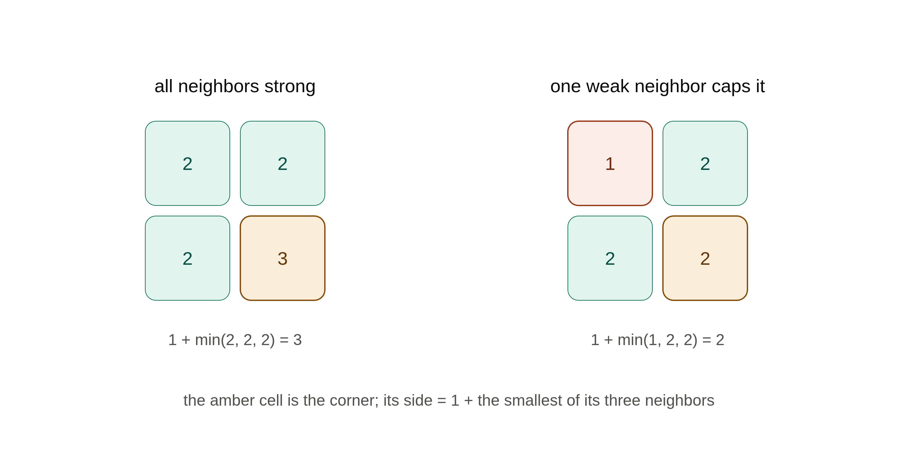
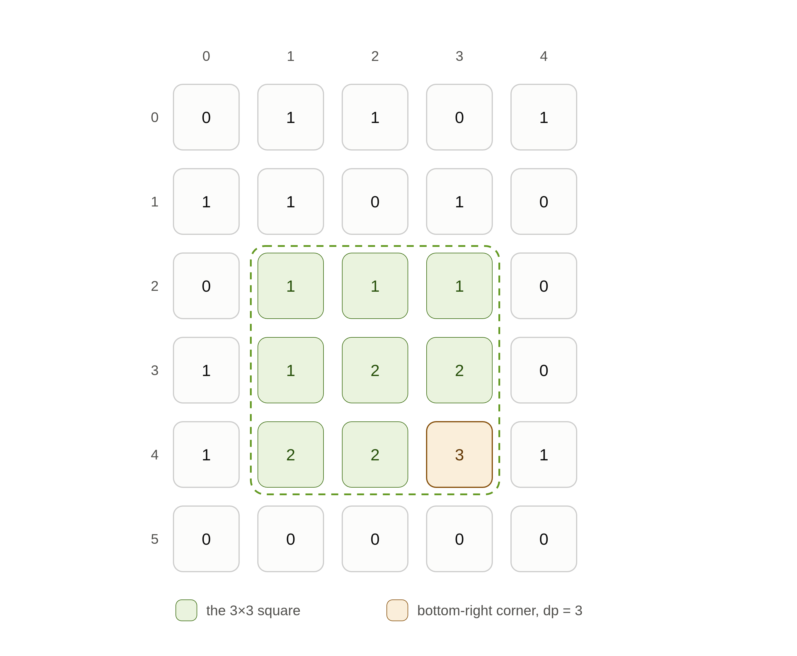

## 1. Quick intro

During my lunch break at the company today, I started watching a video on Google's interview process. I haven't finished it yet, but the coding problem in it caught my eye right away, and I wanted to try solving it myself (with maybe a hint or two along the way).

## 2. The problem

A farmer wants to farm the largest possible area of good land. The land is given as a matrix of `1`s and `0`s, where `1` means good land and `0` means bad land. The farmer will only plant on a **square** patch of good land, and wants that square to be as large as possible. Help the farmer find the maximum area they can farm.

Example:



## 3. Working it out

My first instinct was to reach for connected-region techniques like DFS or BFS. But that's the wrong tool here 🤔. Those find connected blobs of *any* shape, while this problem demands a **square** — a much more rigid constraint than mere connectivity. A blob of `1`s can be large and fully connected yet still contain no big square at all.

### Step 1 — What are we actually maximizing?

The farmer wants the maximum *area* of a square. But a square's area is just `side²`, so the two quantities rise and fall together — the biggest area always comes from the biggest side. That's a small but freeing reframe: we never have to reason about area directly. We just hunt for the longest possible **side**, then square it at the very end. One less thing to juggle.

### Step 2 — The brute-force approach

Let's start with the obvious way. Treat every cell as a top-left corner, try squares of size 1, 2, 3, … growing out from it, and check whether every cell inside is a `1`. Keep the biggest one that works.

This absolutely works, but watch how wasteful it is: to verify a 4×4 square we rescan all 16 cells — most of which we *already* scanned when we verified the 3×3 sitting inside it. We keep recomputing the same sub-answers over and over. Whenever you catch yourself re-deriving something you already knew, that's the signal to **cache** — and caching sub-answers is exactly what dynamic programming is for. Here we go 🫵.

### Step 3 — Find the subproblem

The question to figure out is *not* "Does a square of size k **start** here?" That's a bad question, because it points down-and-right into cells we haven't examined yet. Instead, flip it around: "What's the largest square whose **bottom-right corner** is this cell?"

Why the bottom-right corner? Because if we sweep the grid top-to-bottom, left-to-right, then by the time we reach a cell, its three relevant neighbors — the one above, the one to the left, and the one diagonally up-left — are already solved. We only ever depend on answers we've already computed.

### Step 4 — What does a square ending matter?

Let `dp[i][j]` be the side length of the largest square whose bottom-right corner is cell `(i, j)`.

If the land is bad (`0`), no square can end here, so `dp[i][j] = 0`. If it's good (`1`), then it's at least a 1×1. The real question is: can it grow bigger, and what limits how big? To extend a square ending at `(i, j)` out to side `k`, all three of its neighbors — above, left, and diagonally up-left — must already support a square of side `k − 1`. If any one of them falls short, we can't complete the bigger square.

### Step 5 — Spot the bottleneck

The limit isn't the *sum* of the three neighbors, and it isn't the *max* — it's the **minimum**. The smallest neighbor is the bottleneck: a single weak neighbor is enough to cap how big the square can be.



So for a cell that holds a `1`, the whole recurrence collapses to: **take the smallest of the three already-computed neighbors and add one.** In the left example, all three neighbors hold a 2×2, so the corner grows to 3×3. In the right example, one weak neighbor drags the whole thing back down to a 2×2 — we simply can't complete a bigger square when one supporting corner has a gap.

### Step 6 — Extract the answer

The largest square anywhere in the grid is just the largest `dp` value we ever wrote down. So we track a running maximum as we fill the grid, and square it at the end.

A couple of edge cases to keep in mind: cells in the very first row or first column have no neighbors above or to the left, so their `dp` value is simply their own value (`0` or `1`) — they can only ever anchor a 1×1. And an all-bad grid correctly yields `0`.

Putting it all together: we treat each cell as the bottom-right corner of a potential square, iterate top-to-bottom and left-to-right, and store results in a `dp` grid. Whenever `farm[i][j] == 1`, we apply the recurrence:

```
dp[i][j] = 1 + min(dp[i - 1][j - 1], dp[i][j - 1], dp[i - 1][j])
```

which takes the minimum of the cell above, the cell to the left, and the cell diagonally up-left, then adds one. The largest value that ever lands in `dp` is the longest side, and squaring it gives the final answer.



## 4. Implementation

Based on all that, here's my implementation:

```python
from typing import List

def process_farm(farm: List[List[int]]) -> int:
    if not farm or not farm[0]:
        return 0

    rows, cols = len(farm), len(farm[0])
    dp = [[0] * cols for _ in range(rows)]
    best = 0

    for i in range(rows):
        for j in range(cols):
            if farm[i][j] == 1:
                if i == 0 or j == 0:
                    # first row or first column -> only a 1x1 fits
                    dp[i][j] = 1
                else:
                    # 1 + min(up-left, left, up)
                    dp[i][j] = 1 + min(dp[i - 1][j - 1], dp[i][j - 1], dp[i - 1][j])
                best = max(best, dp[i][j])

    return best ** 2
```

The time complexity is **O(rows × cols)** — we visit each cell exactly once and do constant work per cell — and the space complexity is also **O(rows × cols)** for the `dp` grid. (We could shrink the space to O(cols) by keeping only the previous row, but the full grid is easier to reason about.)

## 5. Follow-up

A likely next question: *what if any **rectangle** of good land counts, not just a square?*

The square trick won't carry over, since a square is one number (its side) while a rectangle has two independent dimensions. We could try some hints:

- **Go row by row.** For each row, find the best rectangle whose base sits on it. The overall answer is the best across all rows.
- **Turn each row into bars.** For every cell, count how many `1`s stack up directly above it (a `0` resets the count to `0`). Now each row is a **histogram** of heights.
- **Reuse a classic.** "Best rectangle with its base on this row" is exactly **"largest rectangle in a histogram"** — solvable in O(width) with a monotonic stack.

Build the heights row by row, run the histogram routine on each, and you get an **O(rows × cols)** solution. The histogram problem is the piece worth learning first — maybe I'll write that one up next.

